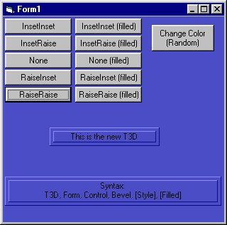

## T3D V2\.0

### Description

An updated version of my award winning T3D-function. The former version only worked with grey forms, now it works with ALL colors, even window system-colors. See screenshot. Complete explanation in the program. The syntax is like this: T3D Form, Control, Bevel, [Style], [Filled]. The style and filled values are optional. I'm using this function a lot in my programs, because it gives a nice screen effect. Fixed text - like labels - give the application a prof look.
 
### More Info
 

             |
---                |---
**Submitted On**   |2000-11-07 23:11:44
**By**             |[stephane swertvaegher](https://github.com/Planet-Source-Code/PSCIndex/blob/master/ByAuthor/stephane-swertvaegher.md)
**Level**          |Intermediate
**User Rating**    |3.3 (13 globes from 4 users)
**Compatibility**  |VB 6\.0
**Category**       |[Coding Standards](https://github.com/Planet-Source-Code/PSCIndex/blob/master/ByCategory/coding-standards__1-43.md)
**World**          |[Visual Basic](https://github.com/Planet-Source-Code/PSCIndex/blob/master/ByWorld/visual-basic.md)
**Archive File**   |[CODE\_UPLOAD114421172000\.zip](https://github.com/Planet-Source-Code/stephane-swertvaegher-t3d-v2-0__1-12615/archive/master.zip)

